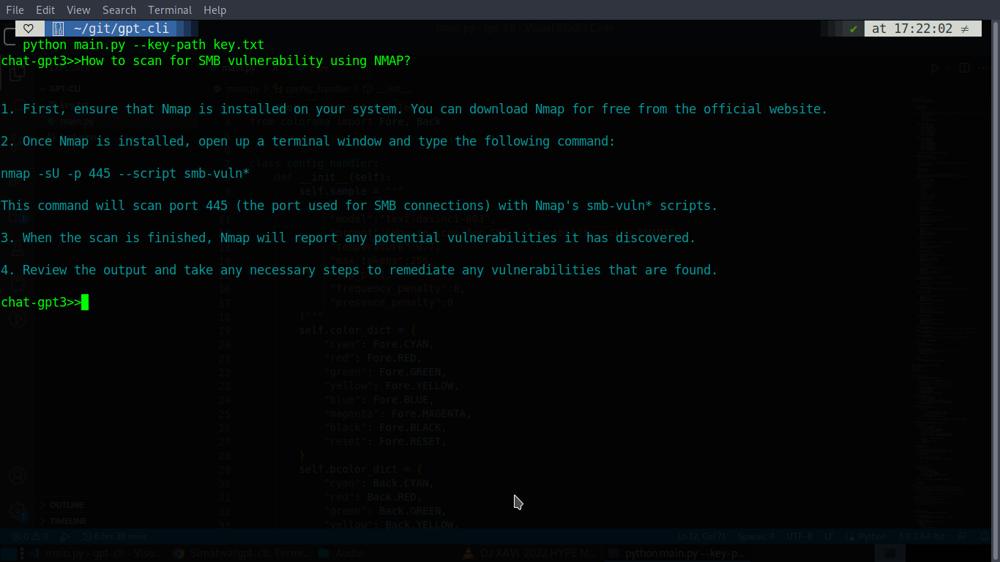

<h1 align="center">gpt-cli</h1>
<p align="center">
<a href="https://github.com/Simatwa/gpt-cli"></a>
<a href="https://wakatime.com/badge/github/Simatwa/gpt-cli"></a>
<a href="#"></a>
<a href="#"></a>
<a href="#"></a>
<a href="#"></a>
</p>

CLI tool for interacting with chatgpt3.



## Installation

Run the following commands at the `terminal` to get started.

```sh
$ git clone https://github.com/Simatwa/gpt-cli.git
$ cd gpt-cli
$ bash install.sh
 #or
$ sudo bash install.sh
```

## Usage 
`gpt-cli -k <gpt-api-key> <Your query>`

e.g

```sh
$ gpt-cli xxxxxxxxxxxxxxxxxx How to scan for SMB vulnerability using NMAP?
```

- For more info run `gpt-cli -h`.