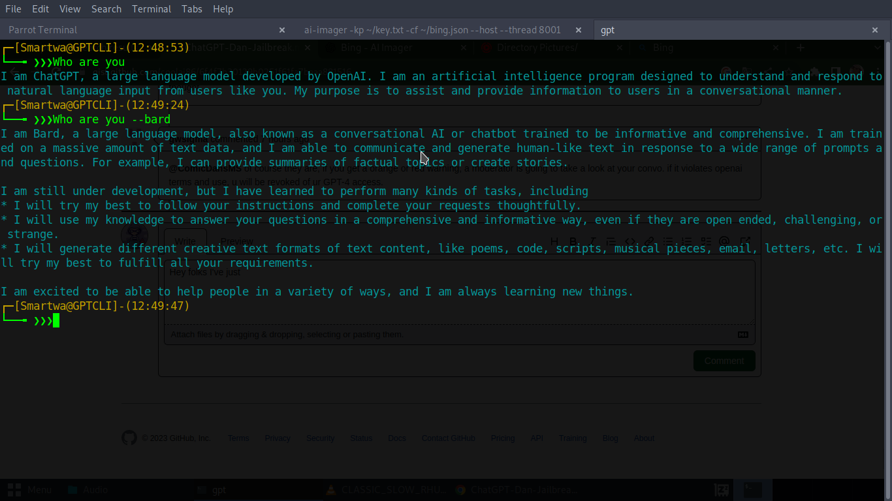

<h1 align="center">gpt-cli</h1>
<p align="center">
<a href="https://github.com/Simatwa/gpt-cli"></a>
<a href="https://wakatime.com/badge/github/Simatwa/gpt-cli"></a>
<a href="#"></a>
<a href="#"></a>
<a href="#"></a>
<a href="#"></a>
</p>

CLI tool for interacting with [Chatgpt-3](https://openai.com).



## [Independencies](requirements.txt)

* [Openai](https://github.com/openai/)
* [Numpy](https://github.com/numpy/numpy)
* [Colorama](https://github.com/tartley/colorama)

### Prerequisites

 - [x] [GPT-api-key](https://platform.openai.com/account/api-keys)

## Installation

### Linux

Running the following commands at the `terminal` will get you ready.

```sh
$ git clone https://github.com/Simatwa/gpt-cli.git
$ cd gpt-cli
$ bash install.sh
 #or
$ sudo bash install.sh
```
### Windows

Executables will be available soon.

## Usage 

Run `$ gpt-cli -k <gpt-api-key> <Your query>` at the terminal.

* For instance :

```sh
$ gpt-cli -k xxxxxxxxxxxxxxxxxx How to scan for SMB vulnerability using NMAP?
```

```
Special character is `:`  
[#] Special commands have a predefined function as shown:

╒═════════════════╤══════════════════════════════════════════════════════╕
│ Command         │ Function                                             │
╞═════════════════╪══════════════════════════════════════════════════════╡
│ :check          │ Gives a shallow display of the response from the API │
├─────────────────┼──────────────────────────────────────────────────────┤
│ :set            │ Configures api request parameters                    │
├─────────────────┼──────────────────────────────────────────────────────┤
│ :response       │ Shows whole feedback from the last request           │
├─────────────────┼──────────────────────────────────────────────────────┤
│ :configurations │ Shows api request parameters                         │
├─────────────────┼──────────────────────────────────────────────────────┤
│ :help           │ Outputs this help info                               │
╘═════════════════╧══════════════════════════════════════════════════════╛

[#] Inputs without special character interacts with the CHAT-GPT3 except:

    (a). font_color : modifies font-color
          e.g 'font_color input red'

    (b). background_color : modifies background_color
          e.g 'background_color cyan'

[#] Use single `:` (full-colon) to interact with the special commands
      e.g ':configurations'

[#] Use double `::` (full-colon) to interact with the system commands
      e.g '::ifconfig'

[NOTE] special characters must occupy the first indexes

[#] Modify the chat-gpt parameters by introducing `:set` command
  e.g ':set model curie'
  ```

  For more info run `gpt-cli -h`.

  ## Motive

As a terminal `lover` I used to find it uncomfortable to keep shifting from one window to next in order to access gpt even after trying out the [gpt-login](https://github.com/Simatwa/gpt-login), the rest is here.

## Contributions

- Anyone is free to [fork](https://github.com/Simatwa/gpt-cli/fork), submit an [issue](https://github.com/Simatwa/gpt-cli/issues) without any **guideline** and suggesting a [pull request](https://github.com/Simatwa/gpt-cli/pulls).
## Acknowledgements

 1. [remo7777](https://github.com/remo7777/T-Header)
